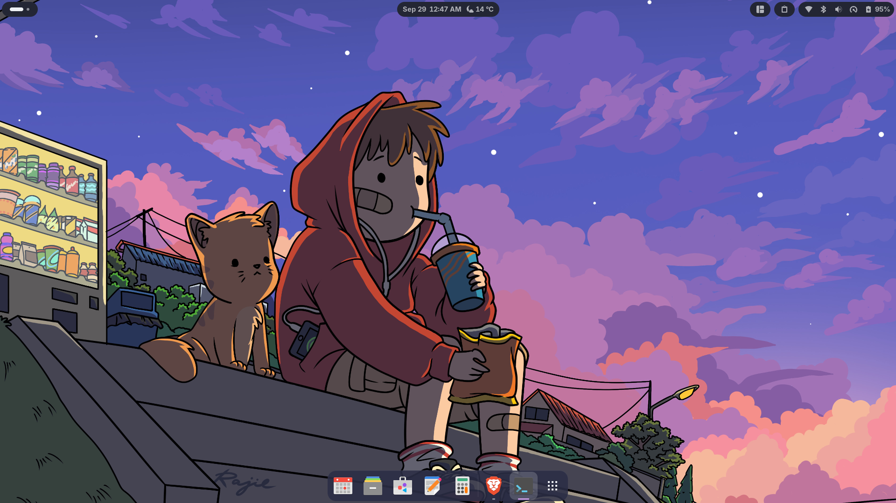
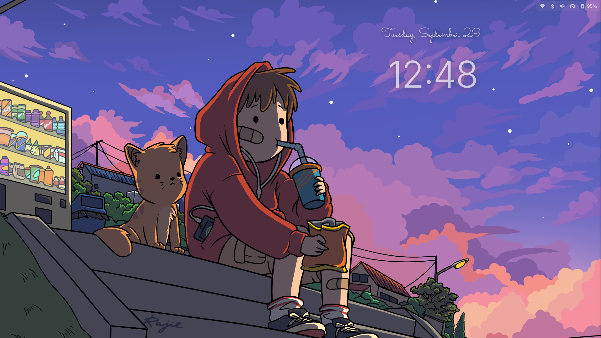

# Fedora Twilight

A soft purple, blue and pink GNOME setup for Fedora. One command installs it,
it survives system updates, and it can recolour itself to match your wallpaper.

**Website:** https://ai-vaibhavv.github.io/fedora-twilight/





## Features

- **Top bar**: transparent, with floating "pill" indicators (Colloid + Catppuccin)
- **Window buttons**: coloured circles in GTK 3, GTK 4, Qt and LibreOffice apps
- **Lock and login screen**: WACK Sonoma-style clock with a handwritten date
- **Icons and cursor**: Papirus Dark with matching folders, Catppuccin cursor
- **Extensions**: Dash to Dock, Just Perfection, Tiling Shell, Rounded Windows,
  Burn My Windows, Clipboard Indicator, Caffeine, Weather O'Clock
- **Terminal**: Ptyxis with a matching palette and light transparency
- **Fonts and sounds**: Inter, JetBrains Mono, Sacramento and a soft sound theme
- **Wallpaper colours**: builds the whole palette from any image
- **Self-repair**: a login service restores anything an update removed

## Requirements

Fedora Workstation 44 with GNOME 50, a network connection and sudo access.

## Install

```bash
sudo dnf install git python3 python3-pillow rsync
git clone https://github.com/ai-vaibhavv/fedora-twilight.git
cd fedora-twilight
./install.sh
```

Run it from a terminal in your GNOME session as your normal user, then log out
and back in.

## Usage

```bash
# Default purple palette
./install.sh

# Match the colours to your wallpaper
./install.sh --wallpaper ~/Pictures/wall.jpg --auto-palette

# Set the wallpaper but keep the current colours
./install.sh --wallpaper ~/Pictures/wall.jpg --keep-palette

# Preview what would run, without changing anything
./install.sh --dry-run

# Run only some parts (list them with --list)
./install.sh --only gtk,qt

# Skip everything that needs sudo
./install.sh --no-sudo

# Check that every piece is installed and working
./install.sh --check
```

Steps: `packages theme gtk icons cursor fonts sounds extensions qt lockscreen settings shortcuts heal`

### Custom colours

Every colour is in [`palette.conf`](palette.conf). Edit it and run `./install.sh`.

To start from a wallpaper instead:

```bash
./scripts/palette-from-wallpaper.py ~/Pictures/wall.jpg           # preview
./scripts/palette-from-wallpaper.py ~/Pictures/wall.jpg --write   # save to palette.conf
```

Changing the wallpaper in GNOME Settings does not recolour Twilight; run the
installer again with `--auto-palette`.

### Keyboard shortcuts

| Keys | Action |
| --- | --- |
| `Super+T` | Terminal |
| `Super+E` | Files |
| `Super+Q` | Close window |
| `Super+V` | Clipboard |
| `Super+M` | Notifications |
| `Super+Ctrl+←/→` | Switch workspace (add `Shift` to move the window) |
| `Super+Shift+C` | Caffeine |

Change them in [`dconf/shortcuts.ini`](dconf/shortcuts.ini). Existing custom
shortcuts on the same keys are kept.

## Supported apps

| Apps | Coloured buttons |
| --- | --- |
| GTK 3 and GTK 4 apps (Files, Terminal, Settings, …) | Yes |
| Flatpak apps | Yes |
| Brave and Chromium (Appearance → Theme: GTK) | Yes; restart after recolouring |
| Qt 6 apps and LibreOffice | Yes |
| VS Code | With `"window.titleBarStyle": "native"` |
| Discord, other Electron apps, X11-only apps | No |

## How it survives updates

- Upstream projects are pinned to tested commits.
- Changes are layered on top of themes, between `fedora-twilight` markers, so they
  can be reapplied at any time.
- Nothing owned by a Fedora package is modified.
- `twilight-heal.service` runs at login, rebuilds the Qt plugin after Qt updates,
  restores missing styles and notifies you about anything that needs attention.

## Files and backups

- Builds, downloads, generated palettes and backups live in `.twilight/` inside
  this repo. Keep the repo in place; the repair service runs from it.
- Each install backs up your GTK config, Twilight files and a dconf snapshot to
  `.twilight/backups/` (the ten newest are kept).
- To remove Twilight, run `./install.sh --uninstall` (preview with `--dry-run`).
  It backs up first, resets the settings Twilight sets to GNOME defaults and removes
  its files, lock screen and service. Packages, extensions from extensions.gnome.org
  and the cursor stay. To get your earlier settings back afterwards, run
  `dconf load / < .twilight/backups/<oldest>/dconf.ini`.
- If a step fails, the installer shows where, finishes the other steps and prints
  the command that reruns only the failed ones.

## Development

```bash
./install.sh --dry-run
python3 -m unittest discover -s tests -v
```

More detail:

- [CURRENT_STATE.md](CURRENT_STATE.md): the known-good desktop, piece by piece
- [DECISIONS.md](DECISIONS.md): why things are the way they are
- [FAILED_EXPERIMENTS.md](FAILED_EXPERIMENTS.md): approaches that were tried and dropped
- [JOURNEY.md](JOURNEY.md): how it was built

## Credits

- Wallpaper: illustration by **Rajie** (not redistributed here; please support the artist)
- [Colloid GTK theme](https://github.com/vinceliuice/Colloid-gtk-theme) (GPL-3.0)
- [QAdwaitaColorfulDecorations](https://github.com/acd407/QAdwaitaColorfulDecorations) (LGPL-2.1)
- [WACK Sonoma Lockscreen](https://github.com/rinzler69-wastaken/wack-sonoma-lockscreen)
- [Rounded Windows](https://github.com/Nathanaelrc/rounded-windows),
  [Papirus](https://github.com/PapirusDevelopmentTeam/papirus-icon-theme),
  [Catppuccin cursors](https://github.com/catppuccin/cursors),
  [Sacramento](https://fonts.google.com/specimen/Sacramento) (OFL)

## License

Scripts and templates in this repository: MIT.
